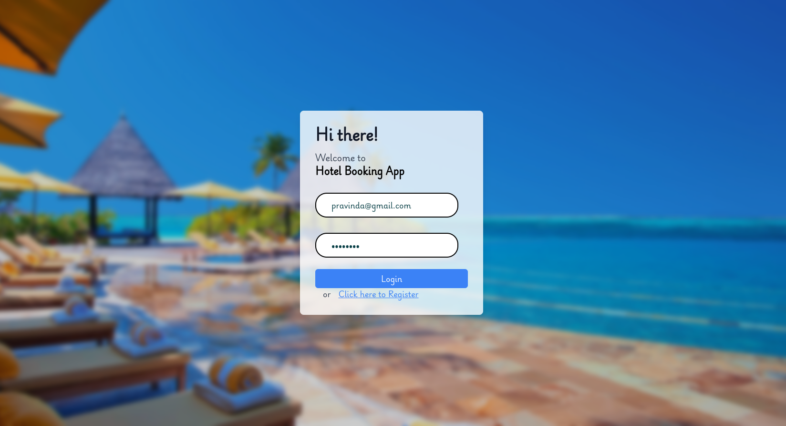

# Hotel Booking Platform

## Version
0.1.0

## Back-end  -  https://github.com/Pravinda-Bandara/Hotel-Booking-Platform-Backend

## Introduction
Welcome to our Hotel Booking Platform! This platform allows users to register and log in securely using JWT (JSON Web Tokens). Once logged in, users can manage their bookings with a user-friendly interface. The backend, powered by the MERN stack (MongoDB, Express.js, React.js, Node.js), efficiently handles HTTP requests, user authentication, and database interactions.

### Features

#### User Features
- **User Authentication:** Users can securely register and log in.
- **Booking Management:** Users can create, read, update, and delete bookings.
- **Responsive Design:** The application is responsive and optimized for both desktop and mobile devices.

### Preview
#### Registration and Login Screenshots

#### Booking Management Screenshots

#### On  mobile devices

### Frontend Technologies Used

- **Framework:** React
- **Styling:** Tailwind CSS
- **State Management:** Context API
- **HTTP Client:** Axios
- **Routing:** React Router
- **Toast Notifications:** React Toastify

### Backend Technologies Used

- **Database:** MongoDB with Mongoose
- **Server:** Node.js with Express

## Usage Disclaimer

This project and its associated images are used for educational and learning purposes. The application and any included images are not intended for commercial use.

## License

Copyright &copy; 2024 Pravinda. All Rights Reserved  
This project is licensed under the [MIT License](LICENSE.txt).
